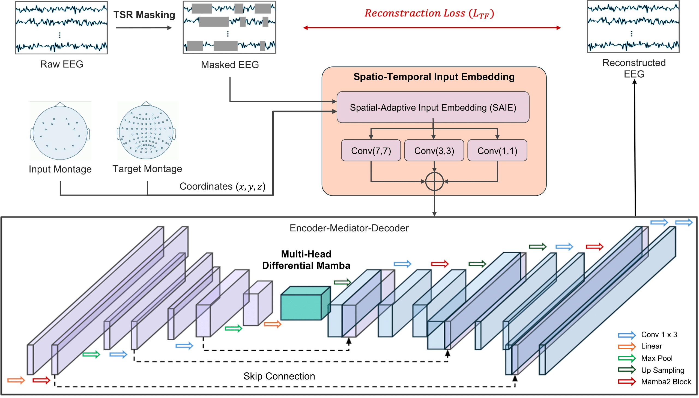
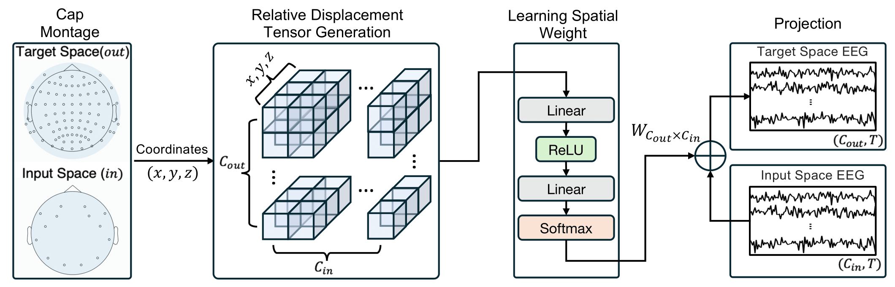
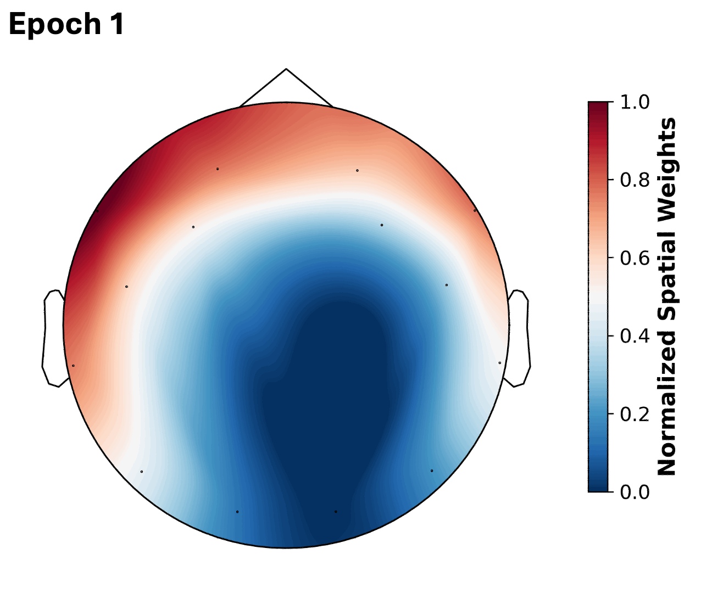
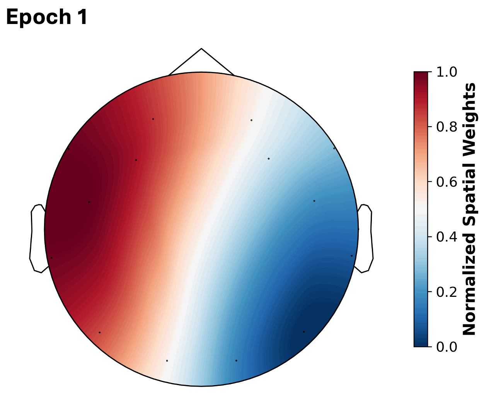
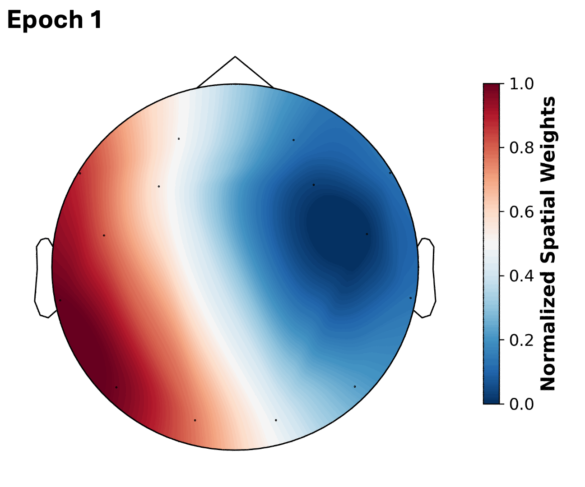
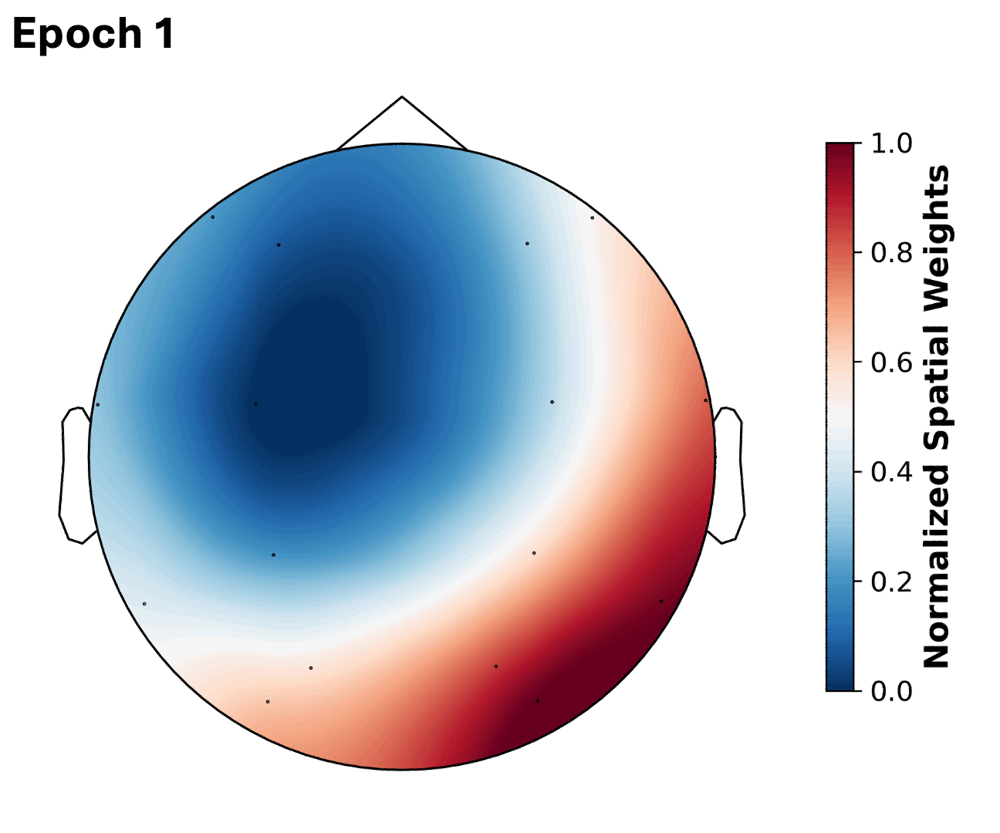
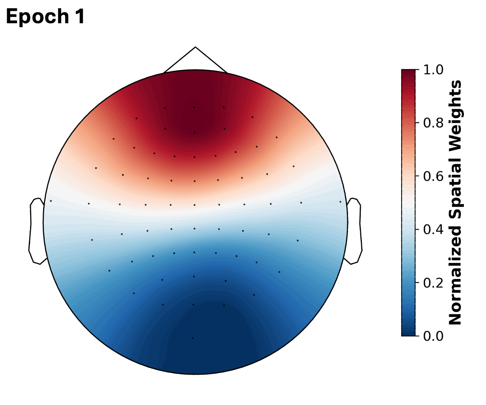

# SAMBA: Toward a Long-Context EEG Foundation Model via Spatial Embedding and Differential Mamba
**Update: July 2025**

**SAMBA** is a scalable self-supervised framework for long-sequence EEG foundation modeling. It integrates 3D spatial-adaptive input embedding and differential Mamba modules to enable robust, efficient, and generalizable EEG representation learning across diverse recording configurations and cognitive tasks.

<p align="center">
  
</p>

---

## Abstract

Modeling long EEG sequences is critical for developing generalizable neural representations, particularly due to the high temporal resolution and extended durations often required to capture brain dynamics. While transformer-based models have shown success on short EEG segments, their quadratic complexity prevents effective scaling to long contexts. Additionally, the diversity in EEG montages and subject variability presents significant generalization challenges.

We introduce **SAMBA**, a self-supervised learning framework featuring a U-shaped encoder-decoder architecture built on the linear-time **Mamba** module. SAMBA incorporates:

1. **Temporal Semantic Random Masking** — to reconstruct semantically masked segments in long sequences;
2. **Multi-Head Differential Mamba** — to reduce redundancy and enhance salient temporal features;
3. **Spatial-Adaptive Input Embedding (SAIE)** — to learn robust 3D spatial representations across heterogeneous EEG devices.

Evaluations across **13 EEG datasets** covering a range of tasks, montages, and sequence lengths demonstrate that SAMBA consistently outperforms state-of-the-art baselines, while maintaining low memory usage and fast inference. In addition, the learned spatial weights exhibit strong alignment with task-relevant neurophysiological regions, suggesting that SAMBA is both **learnable** and **interpretable**.

> 📌 The code is available at: https://github.com/anon1280/SAMBA

---

## Learnable Spatial Embedding Visualization

The figure below illustrates the **Spatial-Adaptive Input Embedding (SAIE)** module and its alignment with neurophysiological topology:

<p align="center">
  
</p>


<table align="center">
  <tr>
    <td align="center">
      <br/>
      <b>Driver Distraction</b>
    </td>
    <td align="center">
      <br/>
      <b>Eyes Close/Open</b>
    </td>
  </tr>
  <tr>
    <td align="center">
      <br/>
      <b>Workload Estimation</b>
    </td>
    <td align="center">
      <br/>
      <b>Abnormal Detection (Seizure)</b>
    </td>
  </tr>
  <tr>
    <td align="center" colspan="2">
      <br/>
      <b>Motor Imagery</b>
    </td>
  </tr>
</table>
---

## Model and Checkpoints

- The full architecture is implemented under `Models/`.
- Two pretrained checkpoints are provided under `Checkpoints/`:
  - `SAMBA-E`: trained using PyTorch Lightning
  - `SAMBA-T`: trained using native PyTorch
- The accompanying paper is currently in preparation. More features and documentation will be released soon.

---

## Repository Structure
```plaintext
SAMBA/
├── Env-requirement/     # Environment configs with dated backups
├── Checkpoints/         # Pretrained SAMBA models (SAMBA-E, SAMBA-T)
├── Models/              # Model architecture implementations
├── utility/             # Supporting functions: data loading, masking, evaluation
├── Experiments/         # PyTorch Lightning training modules
├── Figures/             # Diagrams and visualizations
├── Montage/             # EEG montage metadata for multiple devices
├── Script/              # Helper scripts (e.g., preprocessing, evaluation)
└── README.md            # Project overview